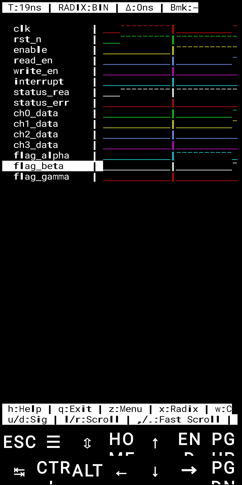
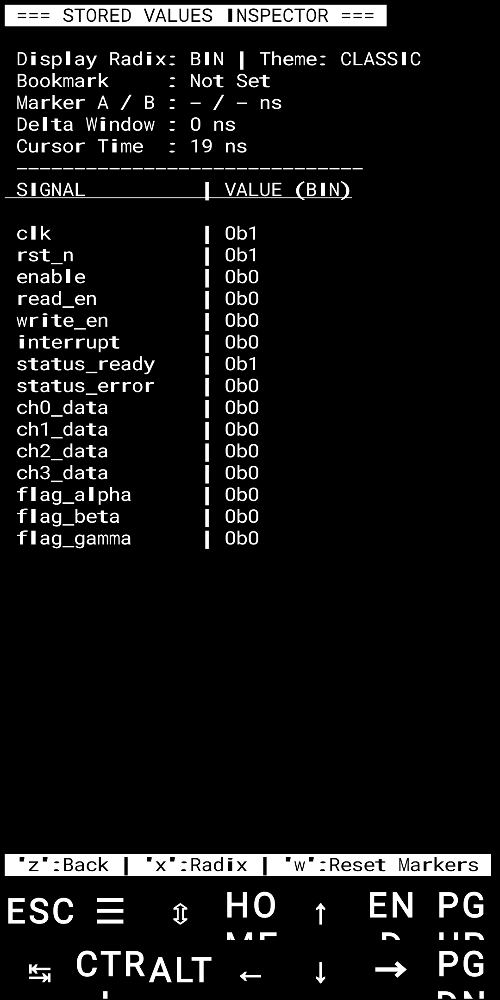

# KittyWave:

A delightful, ultra-lightweight, terminal-based Value Change Dump (VCD) waveform viewer. Built specifically for digital designers, hardware enthusiasts, and computer engineering students who love working directly inside minimal environments like **Termux**, remote **SSH sessions**, or local linux terminals.

No bulky GUI, no heavy dependencies, just your terminal, standard Python curses, and beautiful waveforms. 

---
### 📸 Screenshots

<p align="center">
  
  
</p>

## 🌟 Features

* **Zero Dependencies**: Runs completely on Python's built-in `curses` library. If you have Python, you can run KittyWave!
* **Hierarchy Display & Indentation**: Handles nested design scopes flawlessly with smart indentation.
* **Instant Navigation Tools**: 
  * **Go To Time (`g`)**: Jump straight to any nanosecond timestamp.
  * **Edge Snapping (`n`/`p`)**: Snap instantly to the next or previous value change on the selected signal trace.
  * **Fast Scroll (`,`/`.`)**: Glide through long simulation timelines with a massive 10x chunk movement.
* **Pro-Level Measurements**:
  * **Dual Markers & Delta Window (`m`/`k`/`w`)**: Place Marker A and Marker B to immediately compute precise time deltas. Clear them instantly with a single button press.
  * **Bookmarks (`b`/`v`)**: Drop a pin at a critical moment in your timeline and teleport back to it anytime.
* **Value Search (`s`)**: Scan forward automatically and snap your center cursor directly to the exact moment a signal hits your target value.
* **Live Filtering (`/`)**: Instantly filter your visible signals by a text string to clean up massive simulation files.
* **Stored Values Inspector (`z`)**: Toggle a full-screen dedicated page to inspect all signal states across any radix format simultaneously.
* **Radix & Visual Customization**:
  * Toggle display formats smoothly between **Binary**, **Hexadecimal**, and **Decimal** (`x`).
  * Switch between the sleek **Classic** trace style (`¯`/`_`) and a bold, modern **Block** visual theme (`█`/` `) (`t`).

---

## 📦 Installation

Install KittyWave directly from PyPI:

```bash
pip install kittywave
```

## Running KittyWave:

Use the `kittywave` command:

```bash
kittywave file.vcd
```

## License

This project is licensed under the MIT License. See the LICENSE file for more details.
